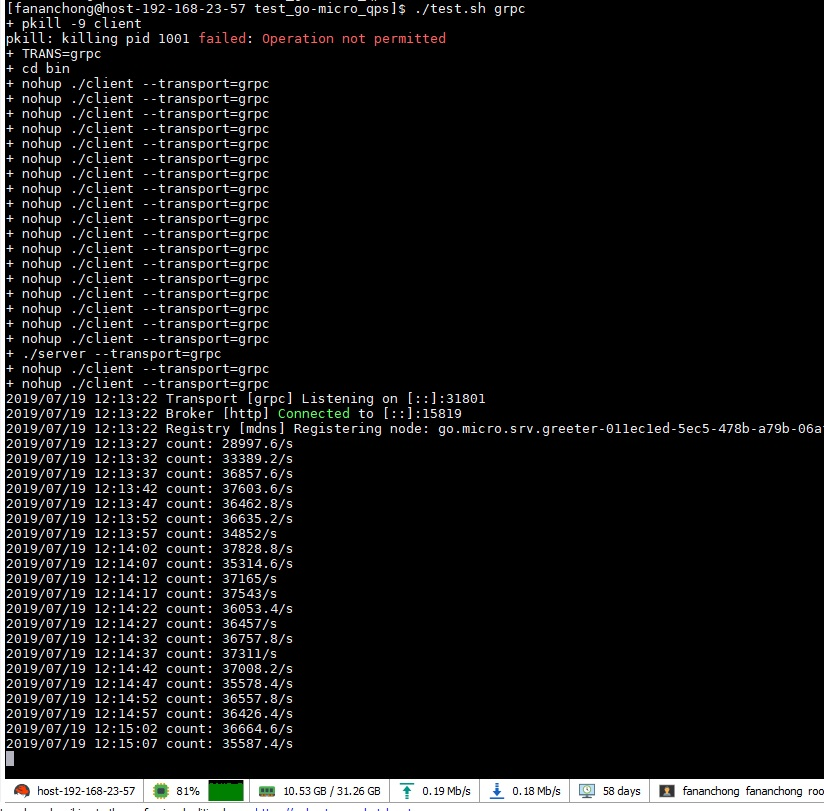
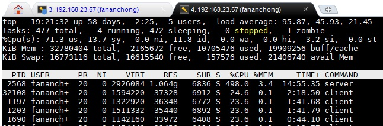

# test_go-micro_qps
测试 go-micro 服务器的 qps ，用来判断是否需要自己写 server/client/transport 插件

## 回显测试

测试代码：
- [server.go](server.go)
- [client.go](client.go)

机器配置： CPU 32核 ； 主频 2599.994

进程数： 1 服务器 ； 20 客户端

启动脚本： [test.sh](test.sh) ; 如 ./test.sh grpc

- grpc

  
  

  结论： 4w/s 级别，CPU占用太高了
