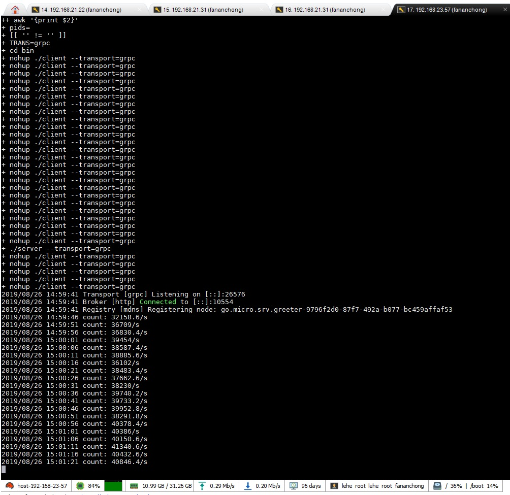
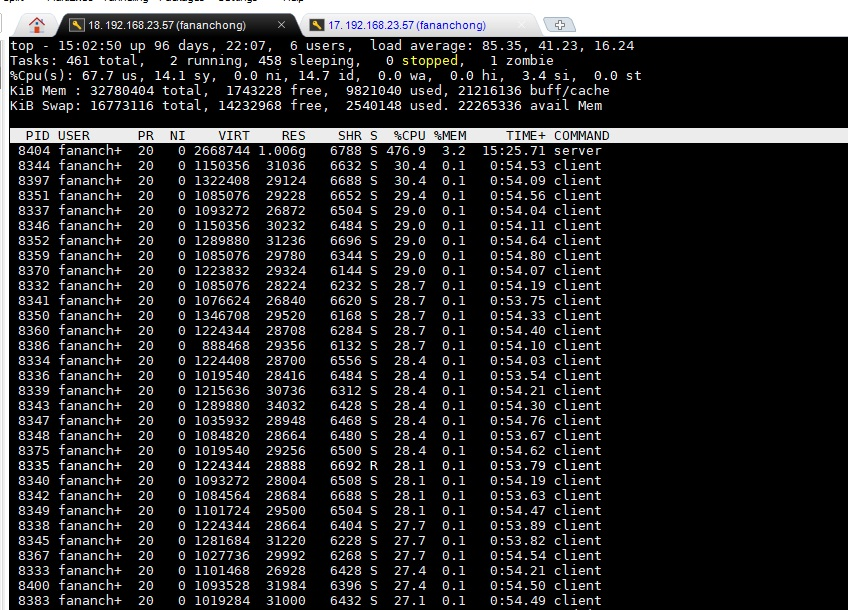
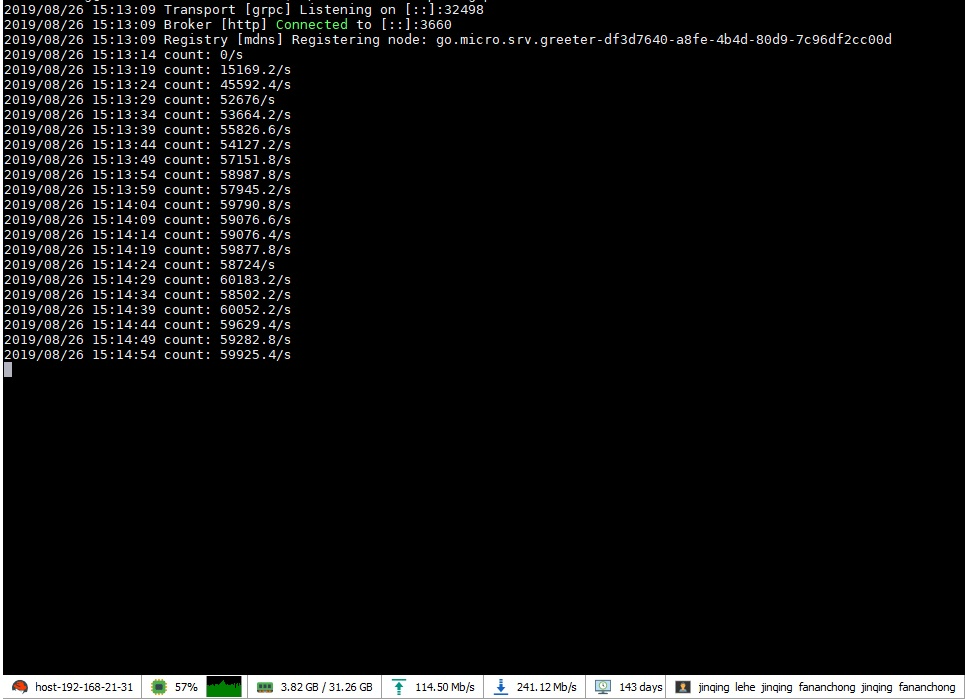
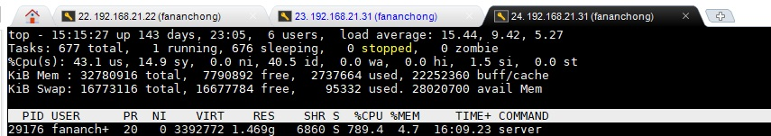
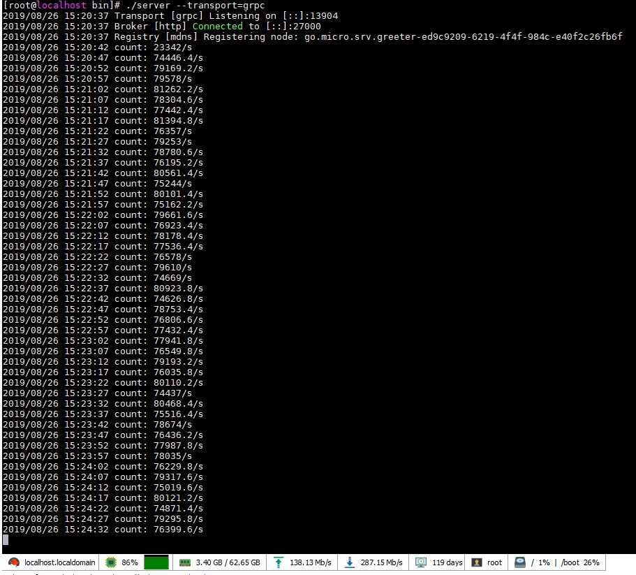
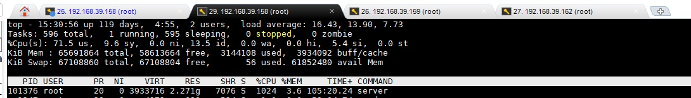
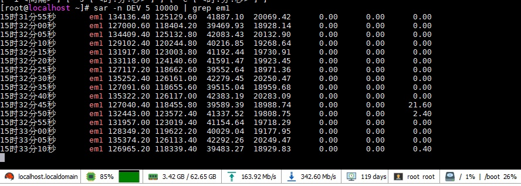

# test_go-micro_qps
测试 go-micro 服务器的 qps ，用来判断是否需要自己写 server/client/transport 插件

## 回显测试

- 测试代码：
  - [server.go](server.go)
  - [client.go](client.go)

  ##### 一、同一主机

  - 机器配置： CPU 16核 ； 主频 2600
  - 进程数： 1 服务器 ； 30 客户端
  - 整机 CPU 84%
  - 服务器程序 CPU 占 29.8% （ 476.9 / 1600 ）
  - 4w qps
  - 该主机为云机

  
  

  ##### 二、同局域网内，多台云机

  - 机器配置： CPU 16核 ； 主频 2600
  - 进程数： 1 服务器 （1 台云机）； 60 客户端 （1 台云机）
  - 服务器程序 CPU 占 49.3%
  - 5.9w qps

  
  
  

  ##### 三、同局域网内，多台物理机

  - 机器配置： CPU 12核 ； 主频 1200 - 1700 （每个核都不一样， 命令 cat /proc/cpuinfo ）
  - CPU 型号： Intel® Xeon® CPU E5-2603 v4 @ 1.70GHz
  - 网卡： 10 Gb/s
  - 进程数： 1 服务器 （1 台物理机）； 60 客户端 （2 台物理机，各 30 个客户端）
  - 服务器程序 CPU 占 85.3%
  - 7.7w qps

  
  
  

## 结论

qps 太低了

## 对比其他测试

见： https://github.com/fananchong/gotcp#%E5%9F%BA%E5%87%86%E6%B5%8B%E8%AF%95

## 分析

见： https://blog.csdn.net/u013272009/article/details/96477194
